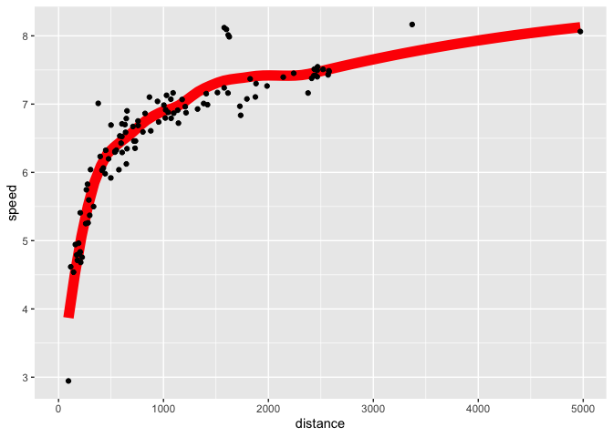

styling code properly
================
Gregory Park
2026-03-01

command + shift + p is a useful shortcut

``` r
library(styler); library(tidyverse); library(nycflights13)
```

variable names: lowercase, underscores, descriptive \> short

make operations well spaced out

``` r
# Strive for
z <- (1 + 2)^2 / 4

# Avoid
z<-( 1 + 2 ) ^ 2/4
```

new arguments on new lines

``` r
# Strive for
flights |>  
  group_by(tailnum) |> 
  summarize(
    delay = mean(arr_delay, na.rm = TRUE),
    n = n()
  )

# Avoid
flights |>
  group_by(
    tailnum
  ) |> 
  summarize(delay = mean(arr_delay, na.rm = TRUE), n = n())

# Strive for 
flights |>  
  group_by(tailnum) |> 
  summarize(
    delay = mean(arr_delay, na.rm = TRUE),
    n = n()
  )

# Avoid
flights|>
  group_by(tailnum) |> 
  summarize(
             delay = mean(arr_delay, na.rm = TRUE), 
             n = n()
           )

# Avoid
flights|>
  group_by(tailnum) |> 
  summarize(
  delay = mean(arr_delay, na.rm = TRUE), 
  n = n()
  )
```

Break long pipes into smaller named subgroups

When using ggplot, follow similar conventions

``` r
flights |> 
  group_by(dest) |> 
  summarize(
    distance = mean(distance),
    speed = mean(distance / air_time, na.rm = TRUE)
  ) |> 
  ggplot(aes(x = distance, y = speed)) +
  geom_smooth(
    method = "loess",
    span = 0.5,
    se = FALSE, 
    color = "red", 
    linewidth = 4
  ) +
  geom_point()
```

    ## `geom_smooth()` using formula = 'y ~ x'

<!-- -->

formatting exercise:

``` r
flights |> 
  filter(dest == "IAH") |> 
  group_by(year, month, day) |> 
  summarise(
    n = n(),
    delay = mean(arr_delay, na.rm = TRUE)
  ) |> 
  filter(n > 10)
```

    ## `summarise()` has regrouped the output.
    ## ℹ Summaries were computed grouped by year, month, and day.
    ## ℹ Output is grouped by year and month.
    ## ℹ Use `summarise(.groups = "drop_last")` to silence this message.
    ## ℹ Use `summarise(.by = c(year, month, day))` for per-operation grouping
    ##   (`?dplyr::dplyr_by`) instead.

    ## # A tibble: 365 × 5
    ## # Groups:   year, month [12]
    ##     year month   day     n delay
    ##    <int> <int> <int> <int> <dbl>
    ##  1  2013     1     1    20 17.8 
    ##  2  2013     1     2    20  7   
    ##  3  2013     1     3    19 18.3 
    ##  4  2013     1     4    20 -3.2 
    ##  5  2013     1     5    13 20.2 
    ##  6  2013     1     6    18  9.28
    ##  7  2013     1     7    19 -7.74
    ##  8  2013     1     8    19  7.79
    ##  9  2013     1     9    19 18.1 
    ## 10  2013     1    10    19  6.68
    ## # ℹ 355 more rows

``` r
flights |> 
  filter(
    carrier == "UA",
    dest %in% c("IAH", "HOU"),
    sched_dep_time > 0900,
    sched_arr_time < 2000
  ) |> 
  group_by(flight) |> 
  summarise(
    delay = mean(arr_delay, na.rm = TRUE),
    cancelled = sum(is.na(arr_delay)),
    n = n()
  ) |> 
  filter(n > 10)
```

    ## # A tibble: 74 × 4
    ##    flight delay cancelled     n
    ##     <int> <dbl>     <int> <int>
    ##  1     53 12.5          2    18
    ##  2    112 14.1          0    14
    ##  3    205 -1.71         0    14
    ##  4    235 -5.36         0    14
    ##  5    255 -9.47         0    15
    ##  6    268 38.6          1    15
    ##  7    292  6.57         0    21
    ##  8    318 10.7          1    20
    ##  9    337 20.1          2    21
    ## 10    370 17.5          0    11
    ## # ℹ 64 more rows
